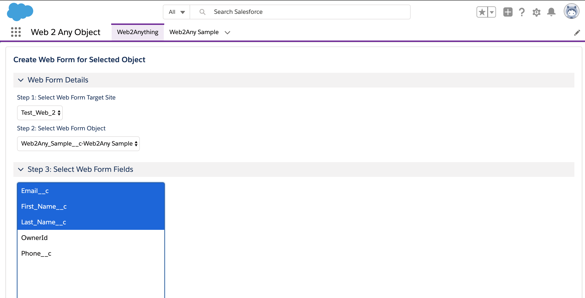
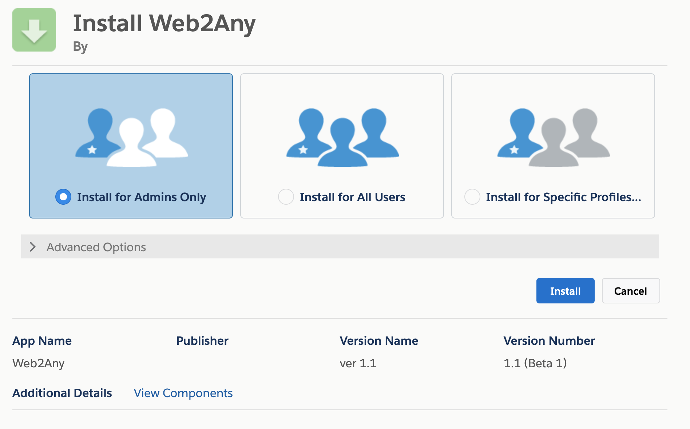
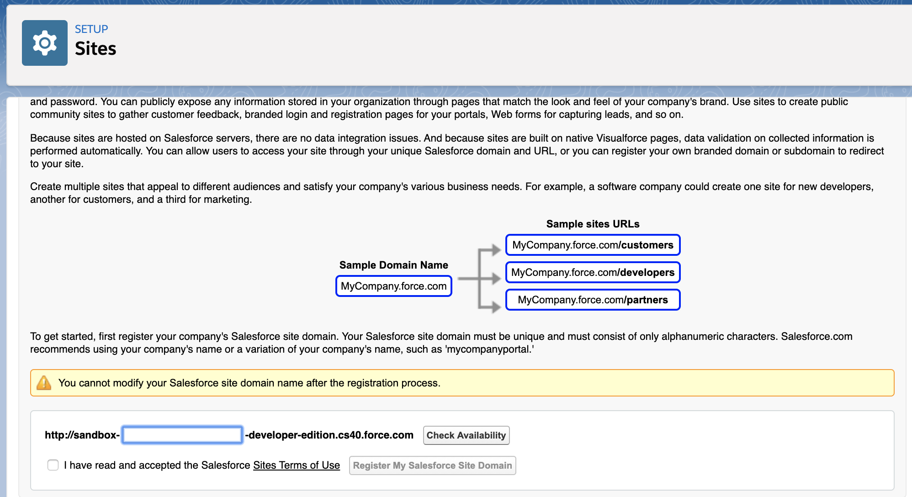
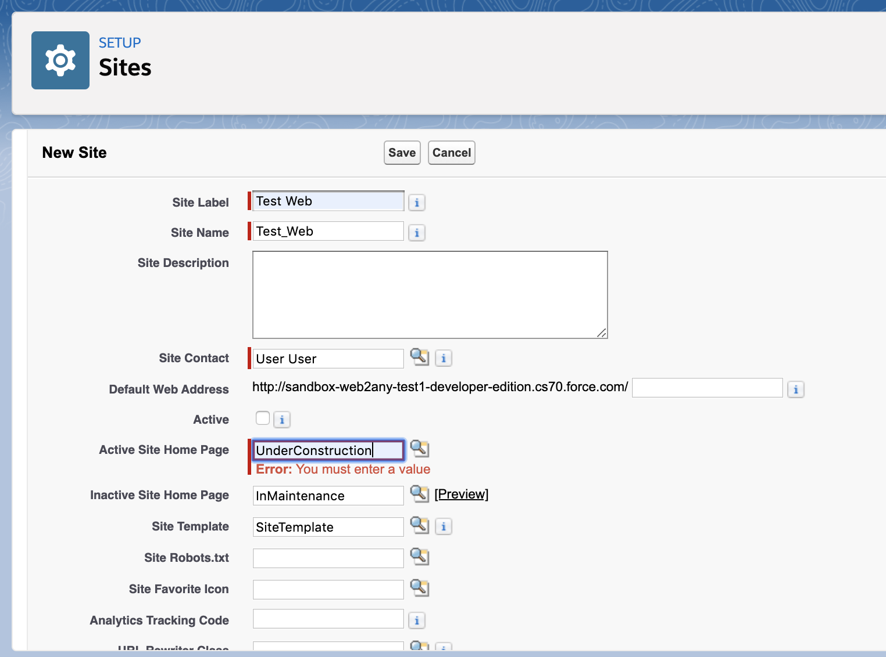
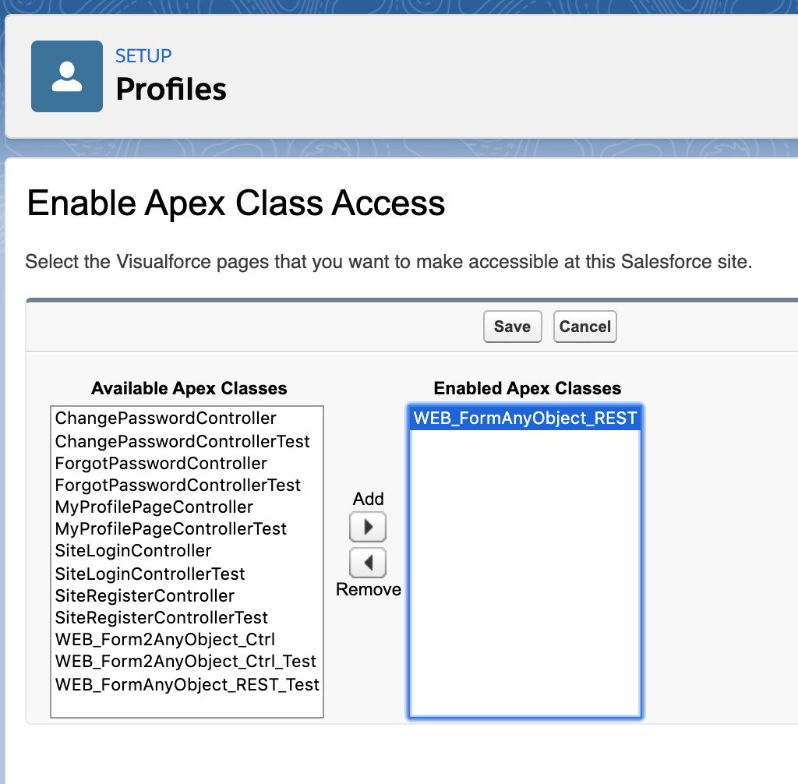

# Salesforce Web2AnyObject App

This guide helps Salesforce developers or admins to deploy/install and configure Web2Any Object utility.
This app enables a webform to post data to any Object similar function as web2case or web2lead.

Supported in Classic and Lightning versions of UI.

This app makes use of Force.com public sites and REST API to send data from any web form. Form HTML code can be generated by this app or created manually based on the template provided later in this document.

This app has been updated to DX project and use of API version 47.0 Winter20 release.

Force.com site is required to be configured on target org, this is not part of this project and must be created manually. MyDomain must be enabled for this package.

## Application Use

To use this app navigate to Web 2 Any app in the app launcher.
select Web2Anything tab - this is a Visual Force page that will help to generate your web form HTML code.

1. Select a site
2. Select the target Object
3. Select multiple fields from the Object fields
4. Generate HTML
5. Copy generated HTML and insert styles to match a hosted web site


Here is an example of an HTML form generated by Web2AnyObject utility. User needs to replace the form action URL with target ORG site URL

```
<form action="https://sandbox-web2any-test2-developer-edition.cs40.force.com/services/apexrest/anyobject" method="POST">
<input type="hidden" name="otype" value="Web2Any_Sample__c" />
<input type="hidden" name="retURL" value="http://" />
<input type="hidden" name="encoding" value="UTF-8" />
<label for="Email__c">Email</label><input id="Email__c" name="Email__c" maxlength="40" size="20" type="text" /><br/>
<label for="First_Name__c">First Name</label><input id="First_Name__c" name="First_Name__c" maxlength="40" size="20" type="text" /><br/>
<label for="Last_Name__c">Last Name</label><input id="Last_Name__c" name="Last_Name__c" maxlength="40" size="20" type="text" /><br/>
<input type="submit" name="submit" />
</form>

```

For testing thsi application a sample custom object `Web2Any_Sample` is provided. To simple quick test user can define a form to send data to this object.
NOTES: User can choose any object available on the list to use as target for this form.

## Installation Instructions

There are two ways to install Web2AnyObject App:

-   [Using Salesforce DX](#installing-web2anyobject-using-salesforce-dx): This is the recommended installation option. Use this option if you are a developer who may want to customize the app and may be contribute to this project code.
-   [Using an Unlocked Package](#installing-web2anyobject-using-an-unlocked-package): This option allows anybody to install and use the Permission Navigator App without installing a local development environment.

## Installing Web2AnyObject using Salesforce DX

1. Set up your environment. Follow the steps in the [Quick Start: Lightning Web Components](https://trailhead.salesforce.com/content/learn/projects/quick-start-lightning-web-components/) Trailhead project. The steps include:

    - Sign up for a developer org and enable Dev Hub
    - Install the latest version of the Salesforce CLI
    - Install Visual Studio Code
    - Install the Visual Studio Code Salesforce extensions, including the Lightning Web Components extension

Follow tehse steps to setup this app in teh scratch org for development. Alternative you can use shell script from Step 3 `dxorgcreate`

1. If you haven't already done so, authenticate with your Developer hub org and provide it with an alias, example (devhub):

    ```
    sfdx force:auth:web:login -d -a devhub
    ```

1. Clone the salesforce-web-to-any-object repository:

    ```
    git clone https://github.com/iandrosov/salesforce-web-to-any-object
    cd salesforce-web-to-any-object
    ```

1. Create a scratch org and provide it with an alias (**web2any** in the command below):

    ```
    sfdx force:org:create -s -f config/project-scratch-def.json -a web2any
    ```

1. Push the app source code to your scratch org:

    ```
    sfdx force:source:push
    ```

1. Open the scratch org:

    ```
    sfdx force:org:open
    ```
1. In the new scratch org navigate to Permission Sets settings and assign Web2Any to your system admin user account that grants access to the app and tabs.
`sfdx force:user:permset:assign -n Web2Any`


1. In App Launcher, select the **Web 2 Any Object** app.


## Installing Web2AnyObject using an Unlocked Package

1. [Sign up](https://www.salesforce.com/form/signup/) for a Developer org or use your existing sandbox, enable My Domain, and deploy it to all users.

1. Click [this link](https://login.salesforce.com/packaging/installPackage.apexp?p0=04t3Z000001ae1EQAQ) to install the unlocked package in your target Production or Developer org `(login.nnnnn.com)`.

1. To install in sandbox or other type of org append following to instance URL: `https://<INSTANCE.force.com>/packaging/installPackage.apexp?p0=04t3Z000001ae1EQAQ`

1. Select **Install for Admin Users**

1. Assign your user a permission set `Web2Any`

1. In App Launcher, select the **Web 2 Any Object** app.

## After Install Manual Configuration

This package requires Admin manula configuration

1. Navigate to Org Settings->Sites and select site domain. (Can use existing site)

1. Create New site with name and select Site Home page (any page will work, example In Maintenance), leave all other configurations as default.

1. Using Public Access setting add REST Apex class `WEB_FormAnyObject_REST` to Guest User profile

1. Activate new site, if it is not active.

## Known Issues

1. If you install a package and launch the app but do not see Web Forme target site, the site was not created. Solution is to follow instruction post-install and configure new Force.com site.

2. If your org is using several Communities you may see multiple sites to choose. Community site can be used as a gateway for Web2Any but, user needs to configure public NOT_Authenticated access for Guest User on the site.


